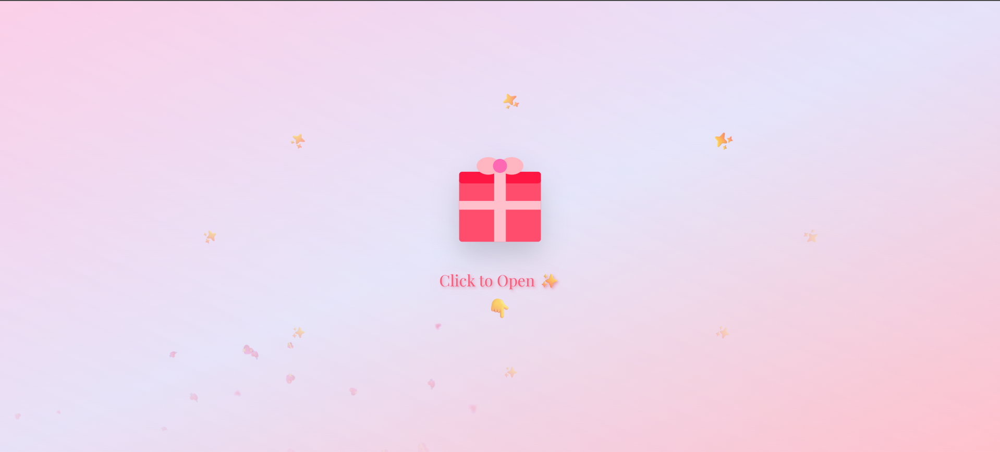
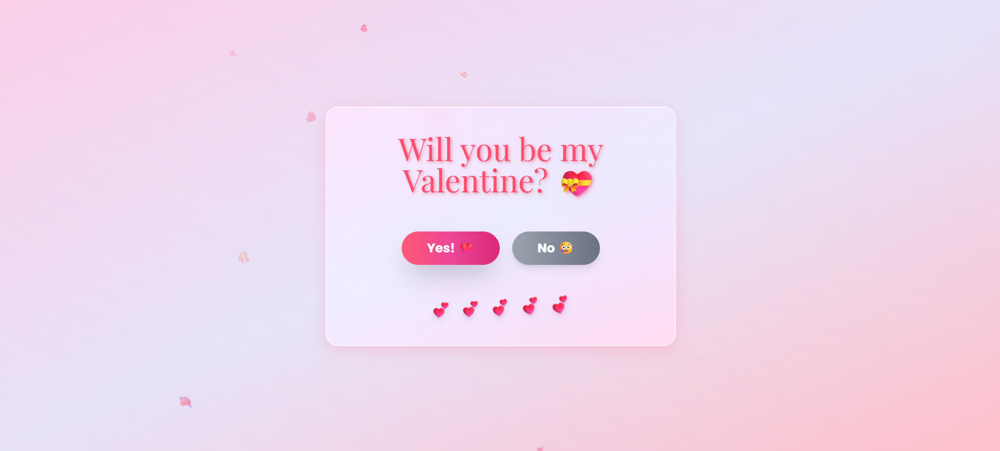
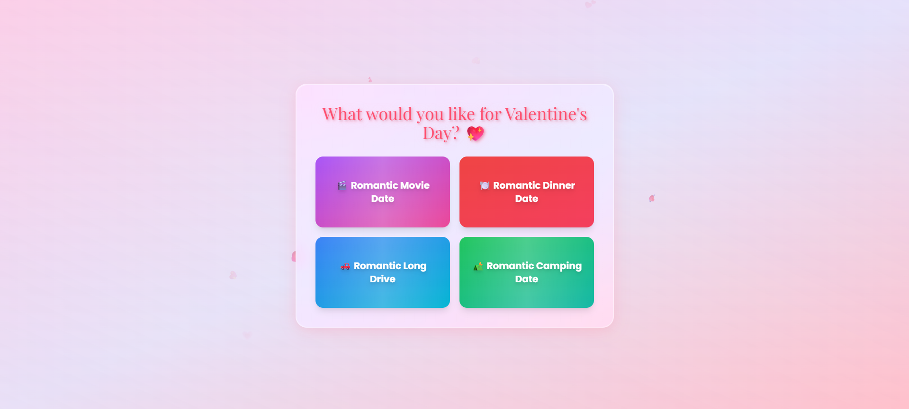
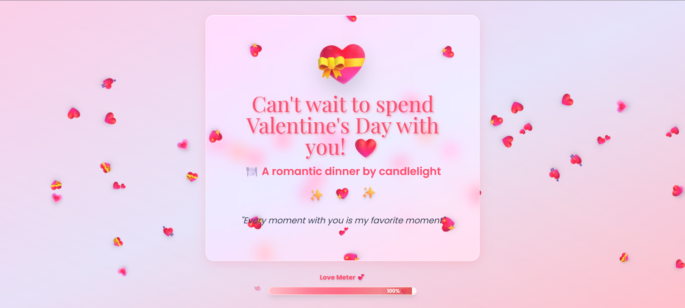

# 💝 Valentine's Day Interactive Proposal Website

A delightful and interactive Valentine's Day proposal website built with React, featuring smooth animations, playful interactions, and a romantic user experience designed to make your special someone smile!






## ✨ Features

### 🎁 Interactive Gift Box Opening
- Animated gift box with sparkle effects
- Click to reveal the Valentine's Day question
- Smooth transitions with Framer Motion

### 💖 Playful Question Screen
- **Moving "No" Button**: The "No" button playfully escapes when users try to click it, making it progressively harder to reach!
- **Heart Door Animation**: Beautiful heart-shaped door opening animation when "Yes" is selected
- Cute encouraging messages that appear with each attempt to decline
- Responsive button animations and hover effects

### 🍽️ Date Selection Screen
- Four romantic date options:
  - 🎬 Romantic Movie Date
  - 🍽️ Romantic Dinner Date (the only selectable option!)
  - 🚗 Romantic Long Drive
  - ⛺ Romantic Camping Date
- **Interactive button behavior**: Non-dinner options playfully move away when approached
- Custom animations for each option
- Cute messages to guide users to the dinner option

### 💕 Final Celebration Screen
- Heartfelt confirmation message
- Animated love meter filling to 100%
- Continuous floating hearts and confetti effects
- Romantic quote display

### 🎨 Visual Effects
- **Floating hearts background** throughout the experience
- **Glass morphism** design with frosted glass effects
- **Gradient animations** with smooth color transitions
- **Shimmer effects** on interactive elements
- **Particle explosions** and heart animations
- **Responsive design** optimized for all screen sizes

## 🚀 Tech Stack

- **React 18.2.0** - Modern React with hooks
- **Vite 5.0.8** - Lightning-fast build tool and dev server
- **Framer Motion 10.16.16** - Smooth, production-ready animations
- **Tailwind CSS 3.4.0** - Utility-first CSS framework
- **PostCSS & Autoprefixer** - CSS processing and vendor prefixing

## 📁 Project Structure

```
valentine-proposal-website/
├── public/
│   └── screenshot/          # Application screenshots
│       ├── image1.png
│       ├── image2.png
│       ├── image3.png
│       └── image4.png
├── src/
│   ├── components/
│   │   ├── DateOptionsScreen.jsx    # Date selection with moving buttons
│   │   ├── FinalScreen.jsx          # Celebration and confirmation
│   │   ├── FloatingHearts.jsx       # Background floating hearts animation
│   │   ├── GiftBoxScreen.jsx        # Initial gift box animation
│   │   └── ValentineQuestion.jsx    # Main question with escaping No button
│   ├── App.jsx                      # Main app component with screen management
│   ├── index.css                    # Global styles and custom utilities
│   └── main.jsx                     # Application entry point
├── index.html                       # HTML template
├── package.json                     # Dependencies and scripts
├── postcss.config.js                # PostCSS configuration
├── tailwind.config.js              # Tailwind CSS customization
└── vite.config.js                  # Vite configuration
```

## 🎯 Key Components

### 1. **GiftBoxScreen**
The entry point of the experience featuring an animated gift box with:
- Floating sparkle effects
- Hover animations
- Heart explosion on opening

### 2. **ValentineQuestion**
The core interaction screen with:
- Dynamic "No" button that moves away progressively
- Heart door opening animation
- Gradient shimmer effects
- Romantic messages

### 3. **DateOptionsScreen**
Interactive date selection featuring:
- Four beautifully styled date option cards
- Only dinner date is selectable
- Other options playfully escape when approached
- Custom animations for each option (confetti, road lines, stars, movie reels)
- Progress tracking for button escape attempts

### 4. **FinalScreen**
Celebration screen with:
- Animated love meter
- Continuous heart confetti
- Romantic quotes
- Floating heart decorations

### 5. **FloatingHearts**
Background ambient animation with:
- 12 continuously floating hearts
- Random sizes, positions, and rotations
- Smooth vertical movement

## 🎨 Custom Styling

### Tailwind Configuration
- **Custom Colors**:
  - `valentine-pink`: #FFC0CB
  - `valentine-red`: #FF4D6D
  - `valentine-lavender`: #E6E6FA

- **Custom Fonts**:
  - `Playfair Display` for romantic titles
  - `Poppins` for body text

- **Custom Animations**:
  - `float` - Smooth vertical floating
  - `bounce-slow` - Gentle bouncing
  - `twinkle` - Opacity pulsing
  - `gradient-slow` - Background gradient animation

### Glass Morphism Effects
Beautiful frosted glass design with:
- Backdrop blur and saturation
- Semi-transparent backgrounds
- Soft shadows and borders
- Hardware-accelerated rendering

## 🛠️ Installation & Setup

### Prerequisites
- Node.js (v16 or higher)
- npm or yarn

### Installation Steps

1. **Clone the repository**
   ```bash
   git clone <repository-url>
   cd valentine-proposal-website
   ```

2. **Install dependencies**
   ```bash
   npm install
   ```

3. **Start the development server**
   ```bash
   npm run dev
   ```

4. **Open in browser**
   - Navigate to `http://localhost:5173`
   - The application will hot-reload on changes

### Build for Production

```bash
npm run build
```

This creates an optimized production build in the `dist/` folder.

### Preview Production Build

```bash
npm run preview
```

## 🎮 User Flow

1. **Landing** → User sees an animated gift box with sparkles
2. **Open Gift** → Click the gift box to reveal the question
3. **Question Screen** → "Will you be my Valentine?" with Yes/No buttons
4. **No Button Escape** → "No" button moves away when approached, with cute messages
5. **Yes Selection** → Heart door animation opens
6. **Date Options** → Choose from four romantic date ideas (only dinner is selectable)
7. **Option Animation** → Custom animation plays for selected option
8. **Final Celebration** → Love meter fills, hearts float, romantic message displayed

## 🎭 Interactive Behaviors

### Moving Buttons
- Buttons that shouldn't be clicked move away when approached
- Movement range increases with each attempt
- Smooth spring animations using Framer Motion
- Touch-friendly for mobile devices

### Animation Details
- All animations are hardware-accelerated
- `will-change` CSS property for optimized performance
- Spring physics for natural movement
- Staggered animations for visual appeal

## 📱 Responsive Design

- **Mobile-first approach**
- Breakpoints for sm, md, lg, xl screens
- Touch-optimized interactions
- Safe area insets for notched devices
- Optimized font sizes and spacing
- Proper viewport configuration

## 🎨 Customization

### Changing Colors
Edit [tailwind.config.js](tailwind.config.js):
```javascript
colors: {
  'valentine-pink': '#YOUR_COLOR',
  'valentine-red': '#YOUR_COLOR',
  'valentine-lavender': '#YOUR_COLOR',
}
```

### Modifying Messages
Edit component files:
- **Question messages**: [src/components/ValentineQuestion.jsx](src/components/ValentineQuestion.jsx)
- **Date options**: [src/components/DateOptionsScreen.jsx](src/components/DateOptionsScreen.jsx)
- **Final message**: [src/components/FinalScreen.jsx](src/components/FinalScreen.jsx)

### Adjusting Animations
Edit animation properties in component files or [tailwind.config.js](tailwind.config.js) for global animations.

## 🚀 Deployment

This project is optimized for deployment on various platforms:

### Vercel (Recommended)

**Option 1: Deploy with Vercel CLI**
```bash
# Install Vercel CLI globally
npm install -g vercel

# Deploy to Vercel
vercel

# Deploy to production
vercel --prod
```

**Option 2: Deploy via Vercel Dashboard**
1. Push your code to GitHub/GitLab/Bitbucket
2. Go to [vercel.com](https://vercel.com) and sign in
3. Click "New Project"
4. Import your repository
5. Vercel will automatically detect the framework and configure settings
6. Click "Deploy"

The project includes a `vercel.json` configuration file that ensures:
- Correct build output directory (`dist`)
- SPA routing support
- Optimized build settings

### Netlify
1. Connect your repository to Netlify
2. Build command: `npm run build`
3. Publish directory: `dist`

### GitHub Pages
```bash
npm run build
# Deploy the dist folder to GitHub Pages
```

## 🌟 Performance Optimizations

- Hardware-accelerated CSS animations
- Lazy loading and code splitting
- Optimized bundle size with Vite
- GPU-accelerated transforms
- Minimal re-renders with React optimization
- Efficient animation handling with Framer Motion

## 🤝 Contributing

Feel free to fork this project and customize it for your own Valentine's Day proposal! Some ideas:
- Add more date options
- Create different themes
- Add background music
- Include photo galleries
- Add countdown timer

## 📝 License

This project is open source and available under the MIT License.

## 💌 Credits

Created with ❤️ for making Valentine's Day proposals extra special!

### Technologies & Libraries
- [React](https://react.dev/)
- [Vite](https://vitejs.dev/)
- [Framer Motion](https://www.framer.com/motion/)
- [Tailwind CSS](https://tailwindcss.com/)
- [Google Fonts](https://fonts.google.com/) - Playfair Display & Poppins

---

Made with 💝 for that special someone.

*Remember: The best proposals come from the heart! This is just a fun way to ask. 💕*
